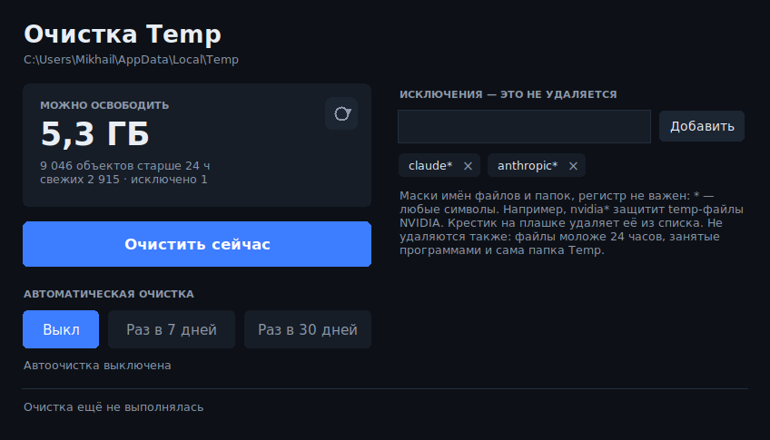
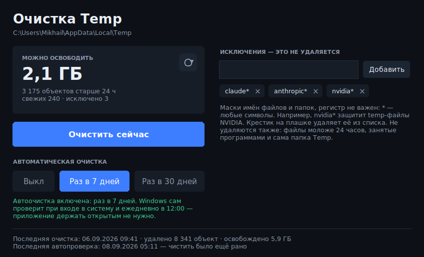

# 🧹 Temp Cleaner

**Безопасно очищает папку временных файлов Windows и освобождает место на диске — одной кнопкой или автоматически по расписанию.**

Со временем в системной папке `%TEMP%` скапливаются гигабайты мусора, который оставляют программы, установщики и обновления. Temp Cleaner удаляет этот мусор аккуратно: не трогает нужные и занятые файлы и не выходит за пределы папки Temp. Настроили один раз — и можно забыть: дальше Windows чистит сам.

## Возможности

- **Очистка в один клик.** Кнопка «Очистить сейчас» удаляет из `%TEMP%` файлы и папки старше 24 часов и показывает, сколько места освободилось.
- **Автоматическая очистка** раз в 7 или 30 дней. Работает через Планировщик заданий Windows, приложение держать открытым не нужно — оно даже не висит в памяти.
- **Списки исключений.** Маска вроде `nvidia*` защитит временные файлы нужной программы — их очистка не тронет. Список правится прямо в окне.
- **Безопасно по умолчанию.** Не удаляет свежие и занятые файлы, не заходит внутрь ссылок, никогда не удаляет саму папку Temp (подробнее — в разделе [«Безопасность»](#безопасность)).
- **Просто и удобно.** Аккуратный тёмный интерфейс, один установщик, работает без прав администратора.

## Установка

1. Скачайте `TempCleaner-Setup.exe` со страницы [**Releases**](https://github.com/MedveDux/TempCleaner/releases).
2. Запустите установщик. Права администратора не нужны — программа ставится в ваш профиль.
3. При первом запуске Windows SmartScreen может показать «Windows защитила ваш компьютер» (программа не подписана платным сертификатом). Нажмите **Подробнее → Выполнить в любом случае**.

Ярлыки появятся на рабочем столе и в меню «Пуск». Удаляется программа как обычно, через «Приложения».

## Как пользоваться

Откройте программу и нажмите **«Очистить сейчас»** — этого достаточно, чтобы освободить место прямо сейчас.

Чтобы очистка шла сама, нажмите **«Раз в 7 дней»** или **«Раз в 30 дней»**. Больше ничего делать не нужно: программу можно закрыть.

## Автоматическая очистка

Когда вы выбираете «Раз в 7 дней» или «Раз в 30 дней», включаются два механизма, и оба запускают очистку, только если с прошлого раза прошло достаточно времени:

- **Задание в Планировщике Windows** — срабатывает раз в день, если компьютер включён.
- **Проверка при входе в систему** — на случай, если в нужный момент компьютер был выключен.

Приложение при этом не остаётся в памяти: система запускает его на долю секунды, оно проверяет, не пора ли чистить, при необходимости чистит и закрывается. Внизу окна всегда видно время последней очистки и последней проверки — так понятно, что автоматика работает, даже когда чистить было нечего.

Кнопка **«Выкл»** полностью отключает автоматическую очистку.

## Исключения

В блоке «Исключения — это не удаляется» можно защитить временные файлы нужных программ.

- Введите маску имени и нажмите «Добавить» (или Enter). Например: `nvidia*`, `MyApp*`, `*.keep`.
- Регистр не важен, `*` заменяет любое число символов.
- По умолчанию в списке `claude*` и `anthropic*`.
- Чтобы убрать маску, нажмите крестик на плашке.

Список сохраняется рядом с программой и учитывается в том числе при автоматической очистке.

## Безопасность

Папка `%TEMP%` по устройству Windows одноразовая: программы складывают туда рабочий мусор и должны нормально переживать его удаление. Тем не менее Temp Cleaner намеренно осторожен и **не удаляет**:

- файлы и папки **моложе 24 часов** — они могут быть нужны работающим программам и установщикам;
- файлы, **занятые** запущенными программами;
- всё, что подходит под **маски исключений**;
- **саму папку** Temp — удаляется только её содержимое.

Программа работает только внутри папки Temp: она проверяет, что в пути есть папка `Temp`/`Tmp`, и откажется работать с корнем диска или домашней папкой. Внутрь символических ссылок она не заходит. Если файл настроек повреждён, очистка отменяется целиком — чтобы не задеть то, что вы защитили.

## Запуск без установки

Если не хотите ставить программу, её можно запустить из исходника. Нужен [Python 3.8+](https://www.python.org/downloads/) (модуль `tkinter` входит в стандартную установку с python.org):

- двойной клик по `temp_cleaner.pyw`, или
- запуск `Start-Temp-Cleaner.bat`.

## Сборка exe и установщика

Инструкция — в [`packaging/BUILD.md`](packaging/BUILD.md). Коротко: на Windows с установленным Python и [NSIS](https://nsis.sourceforge.io/) запустите `packaging\build.bat` — получите `TempCleaner-Setup.exe` для загрузки в Releases.

## Частые вопросы

**Не вижу, чтобы автоочистка работала — программы нет среди процессов.**
Так и должно быть. Очистку по расписанию выполняет Планировщик заданий Windows (его видно командой `taskschd.msc`, задание называется `TempCleanerAuto`), а не постоянно запущенная программа. Свежая дата в строке «Последняя автопроверка» внизу окна подтверждает, что всё работает.

**После включения автоочистки Temp Cleaner появился в автозагрузке — это нормально?**
Да. Это та самая проверка при входе в систему: она запускает программу невидимо и на долю секунды. Кнопка «Выкл» её убирает.

**Где хранятся настройки?**
Рядом с программой: `temp_cleaner_config.json` (исключения и расписание) и `temp_cleaner_log.txt` (краткая история очисток).

## Лицензия

[MIT](LICENSE) © 2026 MedveDux
